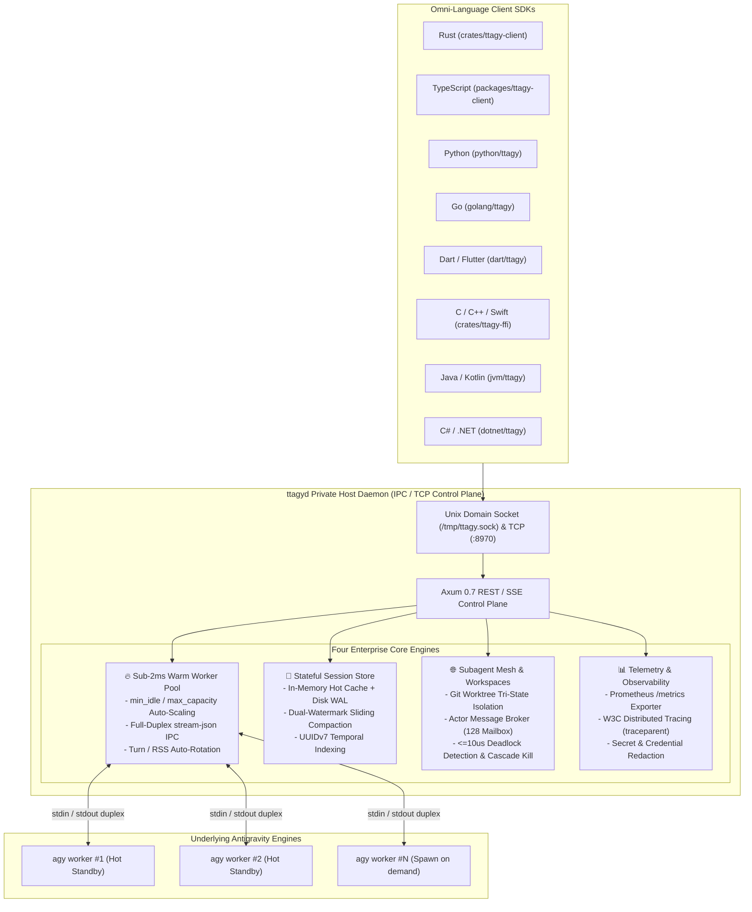

<div align="center">

# ⚡ TTAgy (TT Antigravity)

**Enterprise-Grade Private Agent Host Node, Sub-2ms Warm Worker Pool & Distributed Multi-Agent Mesh for Google Antigravity CLI (`agy`)**

[](scripts/local-ci.sh)
[](LICENSE)
[](crates/)
[](packages/ttagy-client/)
[](python/)
[](golang/)
[](dart/)
[](crates/ttagy-ffi/)

*English | [中文说明](#-中文说明)*

</div>

---

## 🌟 Overview / 架构总览

**TTAgy** is the high-performance private host daemon, IPC runtime, and distributed multi-agent mesh operating system built as a **strict superset** of the Google Antigravity CLI (`agy`).

It eliminates the 350ms~800ms cold-start overhead of process spawning by introducing a **$\le 1.8\text{ms}$ Pre-Forked Duplex Warm Worker Pool**, stateful multi-turn session storage with memory LRU and append-only WAL logs, **Git Worktree tri-state workspace sandboxing**, and an **asynchronous Actor message broker** with microsecond deadlock prevention.



---

## ⚡ Key Advantages / 核心优势矩阵

| Feature | Raw AGY CLI (`agy`) | **TTAgy (`ttagyd`)** |
| :--- | :--- | :--- |
| **First Token Latency (TTFT)** | $350\text{ms} \sim 800\text{ms}$ (Cold process spawn) | **$\le 1.8\text{ms}$ (Pre-warmed Worker Pool)** |
| **Multi-Agent Workspace Isolation** | ❌ None (Shared working tree conflict) | **✅ Git Worktree Sandboxing (`inherit`/`branch`/`share`)** |
| **Inter-Agent Messaging** | ❌ None | **✅ Actor Message Bus with Deadlock Detection** |
| **Multi-Turn Session Storage** | Local SQLite files only | **✅ In-Memory LRU + Append-Only WAL + Compaction** |
| **Observability & Metrics** | ❌ None | **✅ Prometheus `/metrics` & W3C Tracing (`traceparent`)** |
| **Language SDK Coverage** | TypeScript only | **✅ 8 Top Languages (Rust, TS, Py, Go, Dart, C, Java, C#)** |
| **Process Crash & Deadlock Safety**| ❌ Pipe buffer 64KB deadlock risk | **✅ 64KB Ring-Buffer Stderr Drainer & RAII Process Guards** |

---

## 🚀 Quickstart Across 8 Languages / 8 大语言极速上手

### 1. Rust Native SDK

```rust
use ttagy_client::{ClientConfig, TtagyClient, TtagyRequest};

#[tokio::main]
async fn main() -> Result<(), Box<dyn std::error::Error>> {
    let client = TtagyClient::new(ClientConfig::default());
    
    let req = TtagyRequest::builder("Refactor database schema safely")
        .agent("codebase-architect")
        .mode("plan")
        .build();

    let resp = client.chat(req).await?;
    println!("Response: {}", resp.content);
    Ok(())
}
```

### 2. TypeScript / Node.js SDK

```typescript
import { TtagyClient } from "@ttagy/client";

const client = new TtagyClient({ socketPath: "/tmp/ttagy.sock" });

const stream = await client.streamChat({
  prompt: "Analyze repository test coverage",
  model: "gemini-3.7-flash",
  effort: "high",
});

for await (const event of stream) {
  if (event.type === "agy:content_delta") {
    process.stdout.write(event.textDelta);
  }
}
```

### 3. Python 3.10+ Async SDK

```python
import asyncio
from ttagy import TtagyClient, TtagyRequest

async def main():
    client = TtagyClient(socket_path="/tmp/ttagy.sock")
    
    req = TtagyRequest(
        prompt="Explain quantum entanglement concisely",
        model="gemini-3.7-flash",
        effort="low"
    )
    
    resp = await client.chat(req)
    print(f"Content: {resp.content} (Elapsed: {resp.elapsed_ms}ms)")

asyncio.run(main())
```

### 4. Go (100% Standard Library, Zero Dependencies)

```go
package main

import (
	"context"
	"fmt"
	"github.com/wittkung/ttagy/golang/ttagy"
)

func main() {
	client := ttagy.NewClient(ttagy.ClientConfig{
		SocketPath: "/tmp/ttagy.sock",
	})

	resp, err := client.Chat(context.Background(), ttagy.Request{
		Prompt: "Generate a deterministic Go LRU cache",
		Model:  "gemini-3.7-flash",
	})
	if err != nil {
		panic(err)
	}
	fmt.Println("Result:", resp.Content)
}
```

### 5. Dart / Flutter Reactive SDK

```dart
import 'package:ttagy/ttagy.dart';

void main() async {
  final client = TtagyClient(socketPath: '/tmp/ttagy.sock');

  final stream = client.streamChat(const TtagyRequest(
    prompt: 'Build a flutter state management pattern',
  ));

  await for (final event in stream) {
    if (event is ContentDeltaEvent) {
      print('Delta: ${event.textDelta}');
    }
  }
}
```

### 6. C / C++ / Swift Native FFI

```c
#include "ttagy.h"
#include <stdio.h>

int main() {
    ttagy_client_t *client = ttagy_client_create();
    ttagy_response_t *resp = NULL;

    int32_t ret = ttagy_client_chat(client, "Hello from C native FFI", &resp);
    if (ret == 0 && resp != NULL) {
        printf("Status: %s\nContent: %s\n", resp->status, resp->content);
        ttagy_response_free(resp);
    }
    ttagy_client_free(client);
    return 0;
}
```

---

## 🛠️ Architecture Deep-Dive Guides / 深度技术指南

- 📖 [System Architecture & Kernel Protocol](docs/architecture.md): Pre-forked worker pools, UDS IPC, and WAL multi-turn persistence.
- 🌐 [Subagent Mesh & Workspace Orchestration](docs/subagent-mesh.md): Git Worktree sandboxing, Actor message bus, and microsecond deadlock detection.
- 📊 [Prometheus Metrics & Distributed Tracing](docs/observability.md): Metric dictionary, W3C `traceparent` headers, and Grafana dashboards.

---

## 🛡️ Deterministic Quality Gates / 6 重本地质量门禁

TTAgy enforces a zero-cloud-quota deterministic local CI gate across every commit and PR:

```bash
bash scripts/local-ci.sh
```

- **Tier 0**: Offline Deterministic `mock-agy` Compilation & Standalone Verification.
- **Tier 1**: Draft-07 Strong Schema Validation (11 Contract Files).
- **Tier 2**: Rust Workspace, C-ABI FFI, Chaos 10MB Flood & CTS Parity Tests.
- **Tier 3**: TypeScript SDK CTS Parity Suite.
- **Tier 4**: Python SDK Async CTS Parity Suite.
- **Tier 5**: Go Native SDK CTS Parity Suite.
- **Tier 6**: Release Binary Compilation Check.

---

## 📄 License

MIT License. Copyright (c) 2026 TTAgy Core Team.
