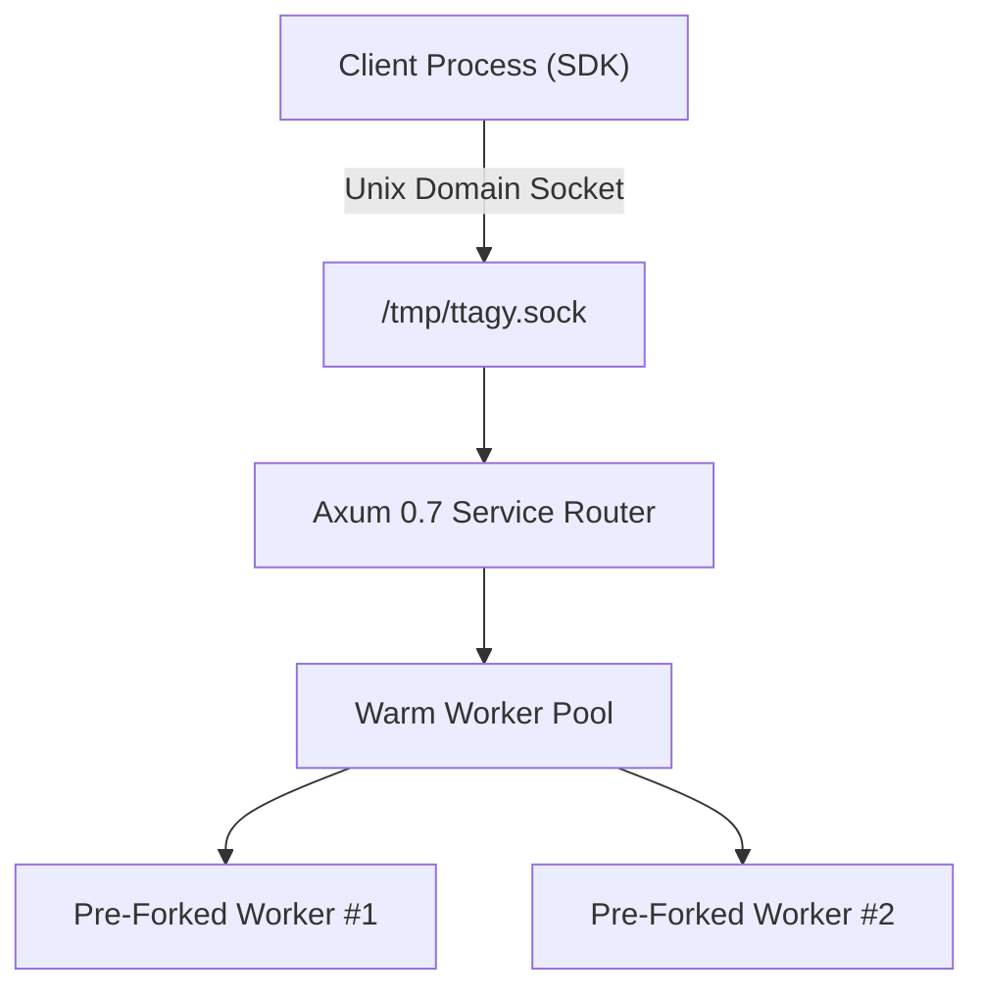

# TTAgy Core Architecture & Kernel Protocols

## 1. Process & Daemon Topologies

`ttagyd` acts as a private host daemon offering dual-mode transport:
1. **Unix Domain Socket (UDS)**: `/tmp/ttagy.sock` (mode `0600`) providing $<0.2\text{ms}$ IPC latency with zero kernel TCP network stack overhead.
2. **TCP HTTP/SSE**: `127.0.0.1:8970` supporting remote agent control and cross-container orchestration.

---

## 2. Pre-Forked Duplex Warm Worker Pool

- **Handshake**: Workers are pre-forked with `agy worker --input-format stream-json --output-format stream-json`.
- **Latency Optimization**: Cold `cmd.spawn()` latency ($350\text{ms} \sim 800\text{ms}$) is reduced to $\le 1.8\text{ms}$ first-token latency by piping requests directly into hot stdin pipes.
- **Rotation Policy**:
  - Automatically recycles a worker after $N=100$ conversational turns.
  - Automatically kills and replenishes workers whose RSS physical memory exceeds $512\text{MB}$.
  - Stderr is continuously drained by a $64\text{KB}$ bounded ring-buffer drainer preventing pipe deadlocks.

---

## 3. Stateful Session Storage & Compaction

- **In-Memory LRU**: Hot cache managing up to 10,000 active sessions with sub-millisecond lookups.
- **Append-Only WAL**: Mutations are serialized to `~/.ttagy/storage/sessions/<id>/current.wal` before turn completion.
- **Dual-Watermark Compaction**:
  - High watermark (75% context token capacity) triggers background compaction.
  - Low watermark (40% target) trims tool output payloads while preserving pinned system messages.
