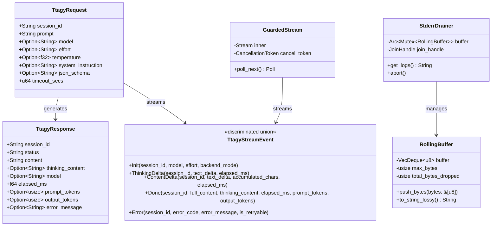
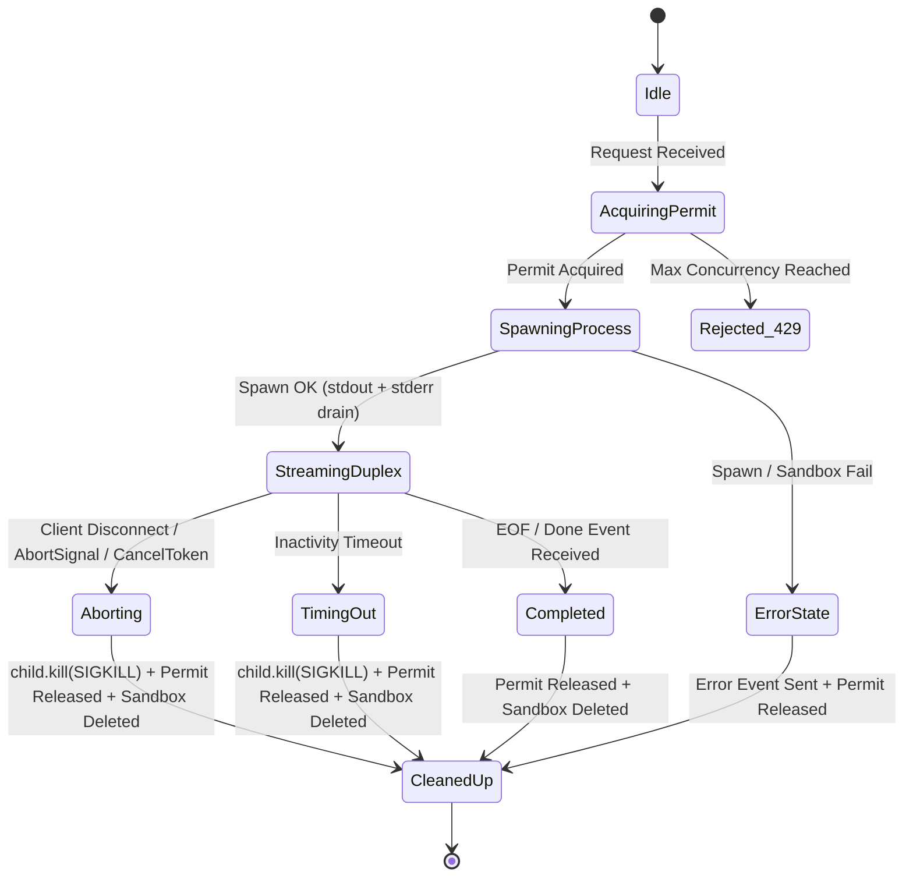
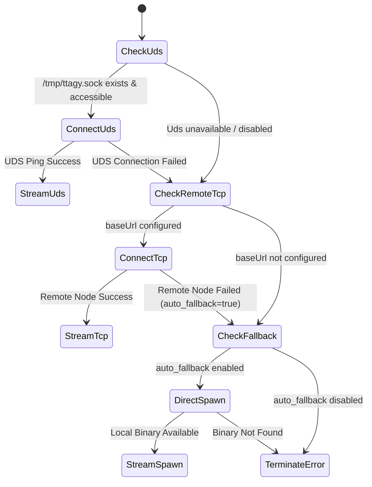

# Data Model & Architecture Entities: TTAgy Evolution

**Feature**: [`specs/001-architecture-audit-evolution`](file:///Users/kevintung/Documents/dev/infra/ttagy/specs/001-architecture-audit-evolution/spec.md)
**Status**: `Completed`
**Created**: 2026-08-24

---

## 1. Core Entity Hierarchy

---

## 2. Type Specifications & Schema Definitions

### 2.1 `TtagyRequest`
| Field | Type | Description | Default |
| :--- | :--- | :--- | :--- |
| `session_id` | `String` | Unique session identifier for tracing | Auto-generated timestamp uuid |
| `prompt` | `String` | Primary input prompt to the model | Mandatory |
| `model` | `Option<String>` | Target model name or alias | `"gemini-3.7-flash"` |
| `effort` | `Option<String>` | Reasoning effort level (`low`, `medium`, `high`, `none`) | `"low"` |
| `temperature` | `Option<f32>` | Sampling temperature (0.0 to 2.0) | `None` |
| `system_instruction` | `Option<String>` | System prompt / instructions | `None` |
| `json_schema` | `Option<String>` | JSON Schema string or file path | `None` |
| `timeout_secs` | `u64` | Inactivity timeout threshold | `60` |

### 2.2 `TtagyResponse`
| Field | Type | Description |
| :--- | :--- | :--- |
| `session_id` | `String` | Associated session identifier |
| `status` | `String` | Execution status (`success`, `error`, `aborted`) |
| `content` | `String` | Final aggregated text output |
| `thinking_content` | `Option<String>` | Full reasoning / thought trace |
| `model` | `Option<String>` | Resolved model name |
| `elapsed_ms` | `f64` | Total end-to-end execution duration in ms |
| `prompt_tokens` | `Option<usize>` | Input token count |
| `output_tokens` | `Option<usize>` | Output token count |
| `error_message` | `Option<String>` | Error details and diagnostics |

### 2.3 `TtagyStreamEvent` (Discriminated by `type`)
- **`agy:init`**: Signals stream initialization. Fields: `session_id`, `model`, `effort`, `backend_mode` (`"daemon_uds"`, `"daemon_tcp"`, `"fallback_direct_spawn"`).
- **`agy:thinking_delta`**: Real-time reasoning / thought tokens. Fields: `session_id`, `text_delta`, `elapsed_ms`.
- **`agy:content_delta`**: Real-time output tokens. Fields: `session_id`, `text_delta`, `accumulated_chars`, `elapsed_ms`.
- **`agy:done`**: Terminal completion event. Fields: `session_id`, `full_content`, `thinking_content`, `elapsed_ms`, `prompt_tokens`, `output_tokens`.
- **`agy:error`**: Terminal failure event. Fields: `session_id`, `error_code`, `error_message`, `is_retryable`.

---

## 3. Lifecycle State Machines

### 3.1 Subprocess & Connection Cancellation Lifecycle

### 3.2 Client Transport Negotiation Flow

