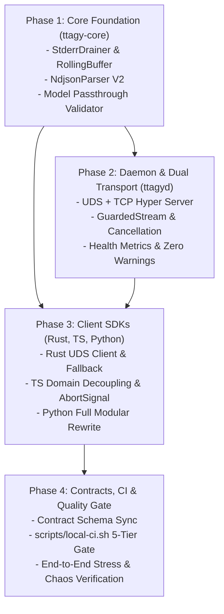

# Implementation Plan: TTAgy Architecture Evolution & Deep Remediation

**Feature**: [`specs/001-architecture-audit-evolution`](file:///Users/kevintung/Documents/dev/infra/ttagy/specs/001-architecture-audit-evolution/spec.md)
**Status**: `Planned`
**Created**: 2026-08-24
**Branch**: `main`

---

## 1. Technical Context & Objectives

The goal of this implementation plan is to comprehensively eliminate all 5 critical defects discovered during the architecture audit, satisfy the requirements defined in `spec.md`, and elevate TTAgy to a production-grade, zero-overhead, multi-transport AI bridge infrastructure across Rust, TypeScript, and Python.

### Core Implementation Tracks:
1. **Track 1 (`ttagy-core`)**:
   - Add `RollingBuffer` and `StderrDrainer` for async duplex non-blocking child stderr drainage.
   - Upgrade `NdjsonParser` to return `Vec<ParsedStreamItem>` with full composite delta support, message unnesting, top-level error capture, and token usage parsing.
   - Implement `resolve_model_name` with safe character validation, exact alias mapping, and transparent passthrough.
2. **Track 2 (`ttagyd`)**:
   - Implement UDS + TCP Dual-Transport listener (`tokio::net::UnixListener` + `tokio::net::TcpListener`) using Axum 0.7 and `hyper_util`.
   - Wrap SSE stream in `GuardedStream` with `CancellationToken` on `PinnedDrop`.
   - Implement `tokio::select!` cancellation loop with `child.kill(SIGKILL)` and RAII `_permit` release.
   - Expose capacity telemetry in `/api/v1/health` and eliminate unused struct field warnings.
3. **Track 3 (`ttagy-client` - Rust SDK)**:
   - Add UDS transport connector (`TransportTarget::Uds` vs `TransportTarget::Tcp`) with auto-fallback.
   - Refactor `FallbackDriver` with `StderrDrainer` and drop-safe cancellation.
   - Clean up unused imports and variables in library and test suites.
4. **Track 4 (`@ttagy/client` - TypeScript SDK)**:
   - Strip all hardcoded TTSubs business domain keys (`paragraphs`, `items`, `glossary`, `concepts`) from `fallback.ts`.
   - Implement balanced-brace state machine `extractStructuredJson` and `repairIncompleteJson`.
   - Add `--output-format stream-json` in fallback spawn and support `TtagyRequest.signal?: AbortSignal`.
   - Support UDS IPC in Node.js via `node:http` `socketPath`.
5. **Track 5 (`python/ttagy` - Python SDK)**:
   - Full modular rewrite: `types.py`, `parser.py`, `detector.py`, `fallback.py`, and `client.py`.
   - Implement async HTTP/SSE remote client (with UDS support via `httpx`), typed stream events, `chat()`, `run_json()`, and test suite in `python/tests/`.
6. **Track 6 (CI/CD & Quality Gate)**:
   - Update `scripts/local-ci.sh` to include Python SDK test execution and UDS integration checks.

---

## 2. Design Artifacts Reference

- **Feature Spec**: [`spec.md`](./spec.md)
- **Technical Research**: [`research.md`](./research.md)
- **Data Model & State Machines**: [`data-model.md`](./data-model.md)
- **Interface Contracts**: [`contracts/`](./contracts/)
- **Verification Quickstart**: [`quickstart.md`](./quickstart.md)

---

## 3. Work Breakdown & Dependency Sequence

### Phase 1: Core Foundation (`ttagy-core`)
- Implement `crates/ttagy-core/src/v1/stderr_drainer.rs`.
- Implement `crates/ttagy-core/src/v1/model.rs`.
- Refactor `crates/ttagy-core/src/v1/parser.rs`.
- Update `crates/ttagy-core/src/v1/types.rs` and `crates/ttagy-core/src/lib.rs`.
- Add unit tests in `crates/ttagy-core/tests/test_core.rs`.

### Phase 2: Daemon Architecture (`ttagyd`)
- Update `crates/ttagyd/Cargo.toml` with `tokio-util` and `hyper-util`.
- Refactor `crates/ttagyd/src/main.rs` to support `--socket`, `--host`, `--port`.
- Refactor `crates/ttagyd/src/v1/routes.rs` with `GuardedStream`, `tokio::select!`, `StderrDrainer`, model validator, and health metrics.
- Add integration tests in `crates/ttagyd/tests/consumer_compat.rs`.

### Phase 3: Cross-Language Client SDKs
- Update `crates/ttagy-client/src/client.rs` and `fallback.rs`.
- Update `crates/ttagy-client/tests/test_client.rs` (clean warnings, test UDS).
- Update `packages/ttagy-client/src/fallback.ts`, `types.ts`, `index.ts`.
- Update `packages/ttagy-client/src/__tests__/client.test.mjs`.
- Create `python/ttagy/types.py`, `parser.py`, `detector.py`, `fallback.py`, `client.py`.
- Create `python/tests/test_parser.py`, `python/tests/test_client.py`.

### Phase 4: CI/CD Quality Gate & Verification
- Update `scripts/local-ci.sh` with Python test step `[5/5]`.
- Execute `bash scripts/local-ci.sh` and verify all tests pass with zero warnings.
