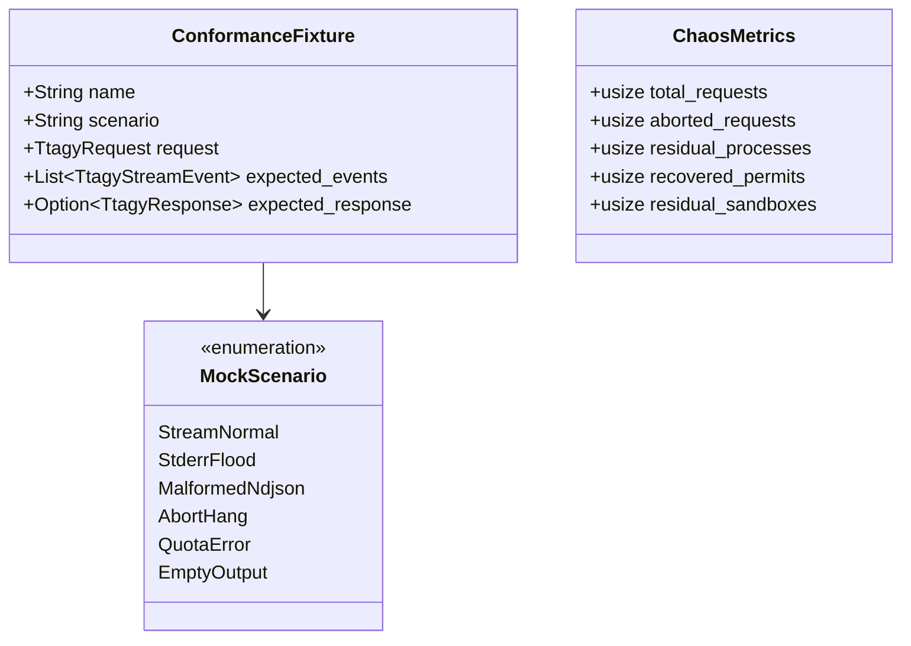

# Data Model: Deterministic Testing & Chaos Suite

**Feature**: [`specs/002-test-infrastructure-and-chaos-suite`](file:///Users/kevintung/Documents/dev/infra/ttagy/specs/002-test-infrastructure-and-chaos-suite/spec.md)
**Status**: `Completed`
**Created**: 2026-08-24

---

## 1. Mock Scenario State Model



---

## 2. Mock CLI Scenario Schema

| Scenario | Behavior on `stdout` | Behavior on `stderr` | Exit Code | Target Failure Mode Tested |
| :--- | :--- | :--- | :--- | :--- |
| `stream_normal` | Emits `step_update` thought/text deltas + `result` | Minimal log output | `0` | Standard streaming happy path |
| `stderr_flood` | Standard NDJSON stream | Emits 10MB of 4KB chunks in tight loop | `0` | Pipe buffer saturation & deadlock |
| `malformed_ndjson` | Mixed raw text, markdown blocks, and JSON | Minimal log output | `0` | Parser resilience & JSON repair |
| `abort_hang` | Infinite sleep loop | None | N/A (killed by SIGKILL) | Parent process kill_on_drop & timeout |
| `quota_error` | `{"type":"error","error":"Quota exceeded"}` | Error trace | `1` | Downstream error mapping |
| `empty_output` | 0 bytes | `Fatal runtime panic` | `1` | Empty stdout & stderr diagnostic fallback |

---

## 3. Conformance Fixture Format

```json
{
  "name": "basic_stream_conformance",
  "scenario": "stream_normal",
  "request": {
    "prompt": "Hello AI",
    "model": "gemini-3.7-flash",
    "effort": "low"
  },
  "expected_event_types": [
    "agy:init",
    "agy:thinking_delta",
    "agy:content_delta",
    "agy:done"
  ],
  "expected_content": "你好，我是 Antigravity AI 助手。"
}
```
