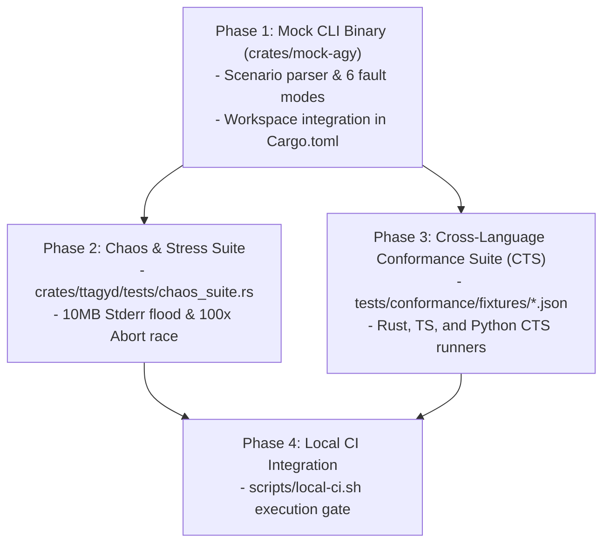

# Implementation Plan: Deterministic Testing Infrastructure & Chaos Suite (CTS)

**Feature**: [`specs/002-test-infrastructure-and-chaos-suite`](file:///Users/kevintung/Documents/dev/infra/ttagy/specs/002-test-infrastructure-and-chaos-suite/spec.md)
**Status**: `Planned`
**Created**: 2026-08-24
**Branch**: `main`

---

## 1. Technical Context & Objectives

This plan implements a professional 4-tier testing infrastructure for TTAgy:
1. **Tier 1 (`mock-agy`)**: Lightweight deterministic mock binary in `crates/mock-agy` with 6 configurable fault injection scenarios.
2. **Tier 2 (Runtime Schema Validation)**: Automated Draft-07 JSON Schema validation on integration test payloads.
3. **Tier 3 (Chaos & Boundary Stress Suite)**: 10MB Stderr flood, 100x rapid connection drop race, and sandbox leak detection in `crates/ttagyd/tests/chaos_suite.rs`.
4. **Tier 4 (Cross-Language Conformance Suite - CTS)**: Shared JSON fixtures in `tests/conformance/` driving Rust, TypeScript, and Python SDKs.
5. **Quality Gate Integration**: Update `scripts/local-ci.sh` to include `mock-agy` build, Chaos tests, and CTS.

---

## 2. Work Breakdown & Dependencies

---

## 3. Tasks Breakdown

- **Phase 1: Mock CLI Binary (`crates/mock-agy`)**
  - Add `crates/mock-agy` to workspace root `Cargo.toml`.
  - Create `crates/mock-agy/Cargo.toml` and `crates/mock-agy/src/main.rs`.
  - Implement scenarios: `stream_normal`, `stderr_flood`, `malformed_ndjson`, `abort_hang`, `quota_error`, `empty_output`.

- **Phase 2: Chaos & Stress Suite**
  - Create `crates/ttagyd/tests/chaos_suite.rs`.
  - Implement 10MB Stderr flood test asserting non-blocking completion.
  - Implement 100x rapid abort race asserting 0 orphan processes and 100% permit recovery.

- **Phase 3: Cross-Language Conformance Suite (CTS)**
  - Create `tests/conformance/fixtures/stream_normal.json`, `thinking_stream.json`, `structured_json.json`.
  - Implement CTS test in Rust (`crates/ttagy-client/tests/conformance_test.rs`).
  - Implement CTS test in TS (`packages/ttagy-client/src/__tests__/conformance.test.mjs`).
  - Implement CTS test in Python (`python/tests/test_conformance.py`).

- **Phase 4: CI/CD Quality Gate Integration**
  - Update `scripts/local-ci.sh` to build `mock-agy` and run Chaos + CTS suites.
  - Run `bash scripts/local-ci.sh` and verify 100% pass with 0 API tokens consumed.
