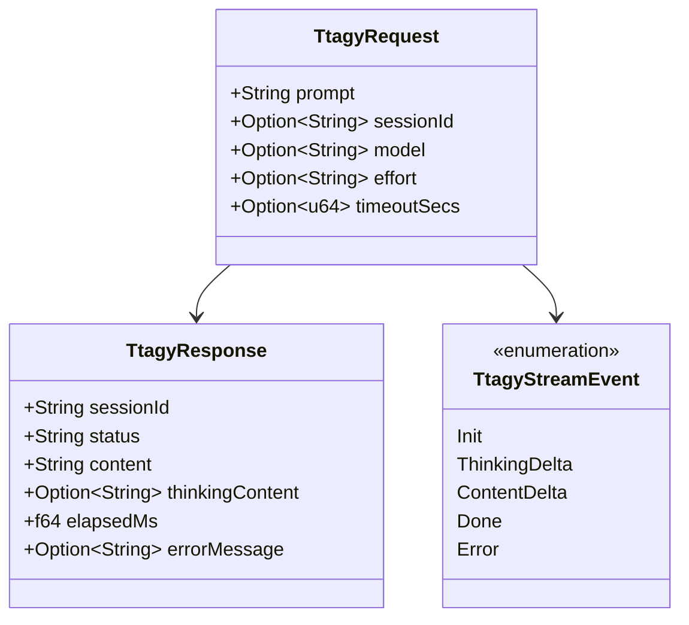

# Data Model: Omni-Language SDK Ecosystem

**Feature**: [`specs/003-omni-language-sdk-ecosystem`](file:///Users/kevintung/Documents/dev/infra/ttagy/specs/003-omni-language-sdk-ecosystem/spec.md)
**Status**: `Completed`
**Created**: 2026-08-24

---

## 1. Multi-Language SDK Type Mappings

---

## 2. Language-Specific Type Mappings

| Generic Contract | C / C-ABI | Go | Dart | Java / Kotlin | C# |
| :--- | :--- | :--- | :--- | :--- | :--- |
| `TtagyRequest` | `ttagy_request_t` | `ttagy.Request` struct | `TtagyRequest` class | `TtagyRequest` record | `TtagyRequest` class |
| `TtagyResponse` | `ttagy_response_t` | `ttagy.Response` struct | `TtagyResponse` class | `TtagyResponse` record | `TtagyResponse` class |
| `TtagyStreamEvent` | `ttagy_event_callback` | `ttagy.StreamEvent` | `TtagyStreamEvent` | `TtagyStreamEvent` | `TtagyStreamEvent` |
| `Client` | `ttagy_client_t` | `ttagy.Client` struct | `TtagyClient` class | `TtagyClient` class | `TtagyClient` class |
