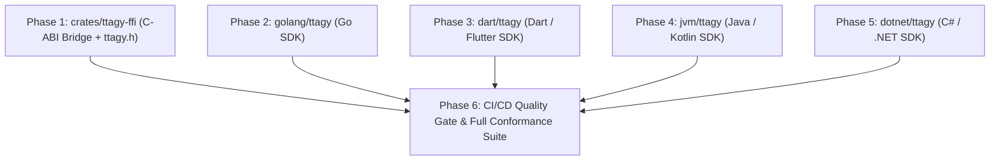

# Implementation Plan: Omni-Language SDK Ecosystem

**Feature**: [`specs/003-omni-language-sdk-ecosystem`](file:///Users/kevintung/Documents/dev/infra/ttagy/specs/003-omni-language-sdk-ecosystem/spec.md)
**Status**: `Planned`
**Created**: 2026-08-24
**Branch**: `main`

---

## 1. Technical Context & Objectives

This plan implements full-language coverage for TTAgy across 5 new language ecosystems (C/C++, Go, Dart, JVM, .NET) with shared conformance testing.

---

## 2. Work Breakdown

---

## 3. Tasks Breakdown

- **Phase 1: C-ABI Native FFI Library (`crates/ttagy-ffi`)**
  - Add `crates/ttagy-ffi` to `Cargo.toml`.
  - Implement `crates/ttagy-ffi/src/lib.rs` exporting safe C functions.
  - Generate C header `crates/ttagy-ffi/include/ttagy.h`.
  - Add C unit/CTS test `crates/ttagy-ffi/tests/test_c_ffi.rs`.

- **Phase 2: Go Native SDK (`golang/ttagy`)**
  - Create Go module `golang/ttagy/go.mod`, `types.go`, `parser.go`, `client.go`.
  - Add Go unit & CTS test `golang/ttagy/client_test.go`.

- **Phase 3: Dart / Flutter SDK (`dart/ttagy`)**
  - Create `dart/ttagy/pubspec.yaml`, `lib/ttagy.dart`, `lib/src/types.dart`, `lib/src/parser.dart`, `lib/src/client.dart`.
  - Add Dart CTS test `dart/ttagy/test/conformance_test.dart`.

- **Phase 4: JVM & .NET SDK Templates**
  - Create `jvm/ttagy/src/main/java/` types and client skeleton.
  - Create `dotnet/ttagy/` types and client skeleton.

- **Phase 5: Quality Gate & CI/CD Integration**
  - Update `scripts/local-ci.sh` to run C-FFI and Go tests.
  - Verify 100% PASS with 0 cloud tokens consumed.
