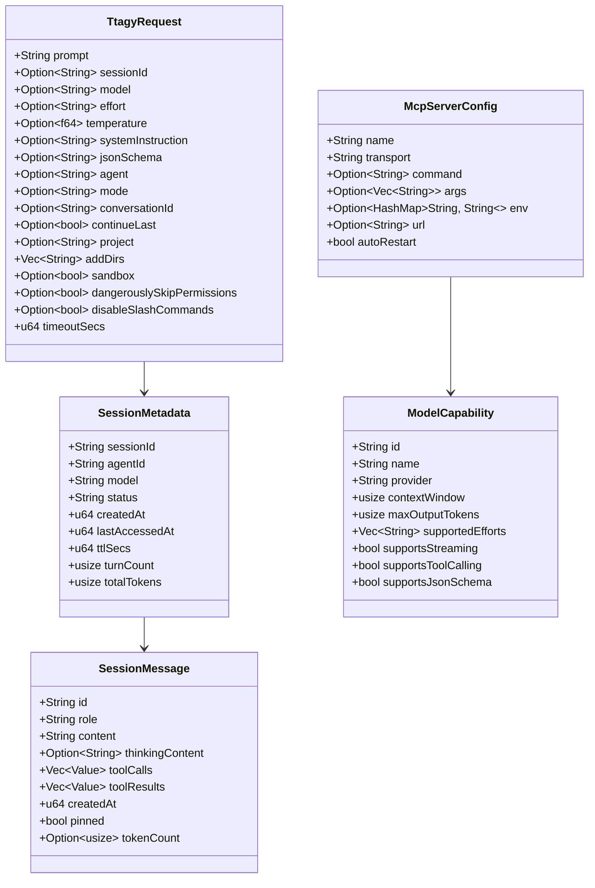

# Data Model: AGY CLI Superset & Session Pool

**Feature**: [`specs/004-agy-cli-superset-and-session-pool`](file:///Users/kevintung/Documents/dev/infra/ttagy/specs/004-agy-cli-superset-and-session-pool/spec.md)
**Status**: `Completed`
**Created**: 2026-08-24

---

## 1. Domain Entity Relationships

