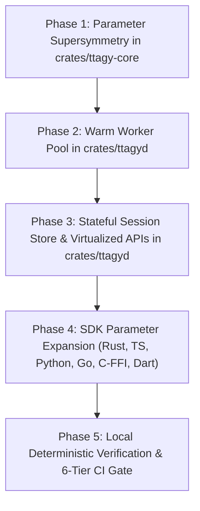

# Implementation Plan: AGY CLI Superset Evolution, Warm Worker Pool & Stateful Session Store

**Feature**: [`specs/004-agy-cli-superset-and-session-pool`](file:///Users/kevintung/Documents/dev/infra/ttagy/specs/004-agy-cli-superset-and-session-pool/spec.md)
**Status**: `Planned`
**Created**: 2026-08-24
**Branch**: `main`

---

## 1. Technical Context & Objectives

This plan implements full AGY CLI parameter supersymmetry, a high-performance sub-2ms pre-forked Warm Worker Pool, a stateful multi-turn session store with memory LRU and disk WAL, and virtualized REST/UDS APIs for models, agents, and MCP servers.

---

## 2. Work Breakdown

---

## 3. Tasks Breakdown

- **Phase 1: Core Type Expansion (`crates/ttagy-core`)**
  - Add `agent`, `mode`, `conversation_id`, `continue_last`, `project`, `add_dirs`, `system_instruction`, `temperature`, `sandbox`, `dangerously_skip_permissions`, `disable_slash_commands` to `TtagyRequest`.
  - Update `TtagyRequest::builder()`.

- **Phase 2: Warm Worker Pool (`crates/ttagyd/src/worker_pool.rs`)**
  - Implement `WorkerInstance` with stdin/stdout pipe duplexing and `stream-json` parsing.
  - Implement `WorkerPool` with `min_idle`, `acquire()`, auto-rotation, and RSS monitoring.

- **Phase 3: Stateful Session Store & Virtualized Control Plane (`crates/ttagyd/src/session_store.rs`, `mcp_manager.rs`, `routes.rs`)**
  - Implement `SessionStore` (Moka LRU Cache + append-only `.wal` persistence + recovery).
  - Implement `McpManager` (dynamic MCP registration and tool discovery).
  - Add routes `/api/v1/models`, `/api/v1/agents`, `/api/v1/mcp/servers`, `/api/v1/sessions` to Axum router.

- **Phase 4: Multi-Language SDK Alignment**
  - Update Rust, TS, Python, Go, Dart, C-FFI SDK request types with full parameters.

- **Phase 5: Local Deterministic CI Gate**
  - Run `bash scripts/local-ci.sh` verifying 100% PASS with 0 cloud tokens.
