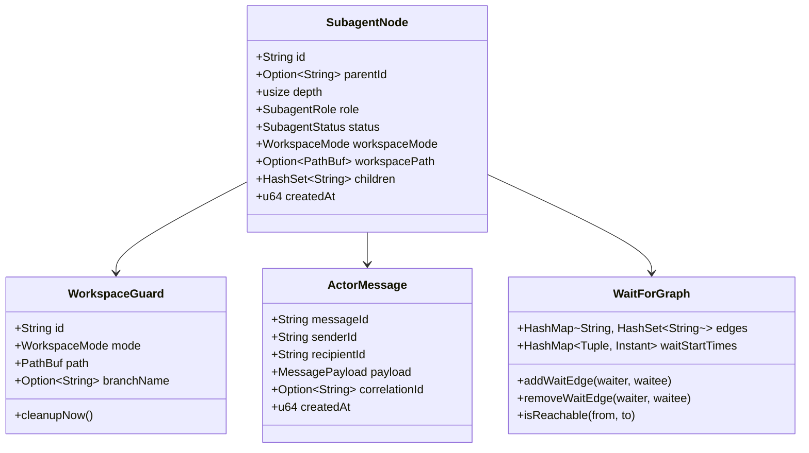

# Data Model: Subagent Mesh & Workspace Orchestration

**Feature**: [`specs/005-subagent-mesh-and-workspaces`](file:///Users/kevintung/Documents/dev/infra/ttagy/specs/005-subagent-mesh-and-workspaces/spec.md)
**Status**: `Completed`
**Created**: 2026-08-24

---

## 1. Subagent Mesh Domain Entities

