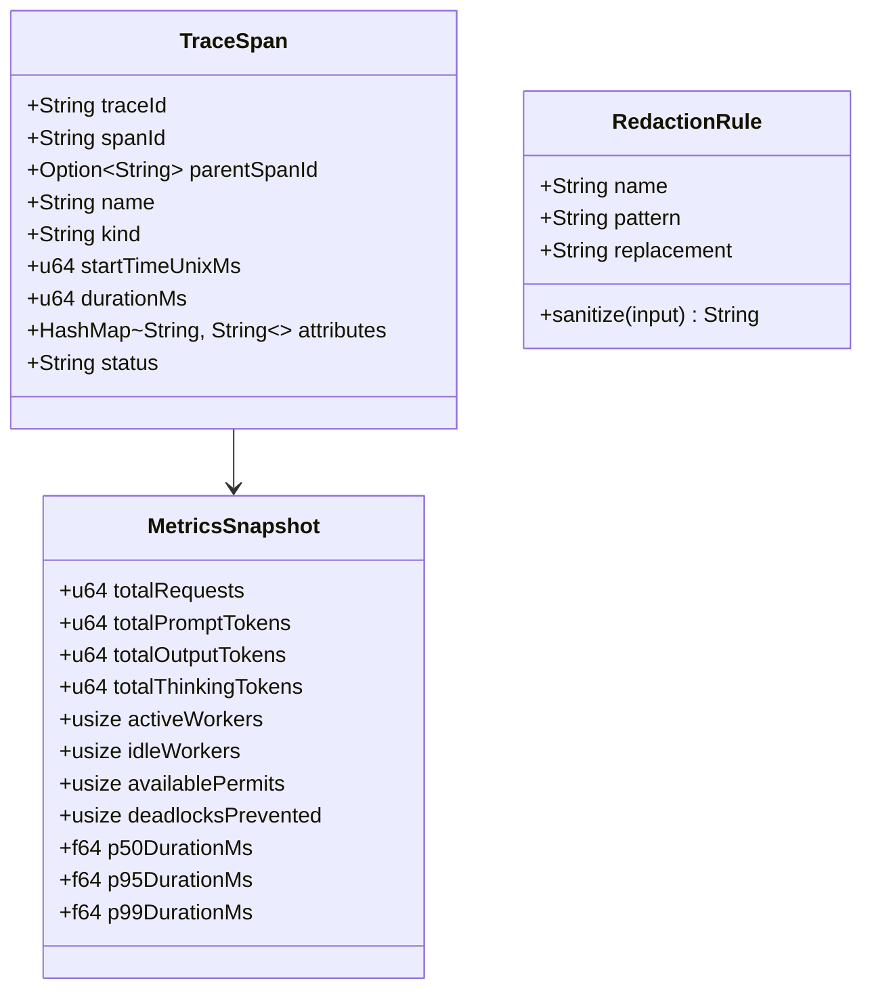

# Data Model: Enterprise Observability & Telemetry

**Feature**: [`specs/006-observability-and-telemetry`](file:///Users/kevintung/Documents/dev/infra/ttagy/specs/006-observability-and-telemetry/spec.md)
**Status**: `Completed`
**Created**: 2026-08-24

---

## 1. Observability Domain Entities

